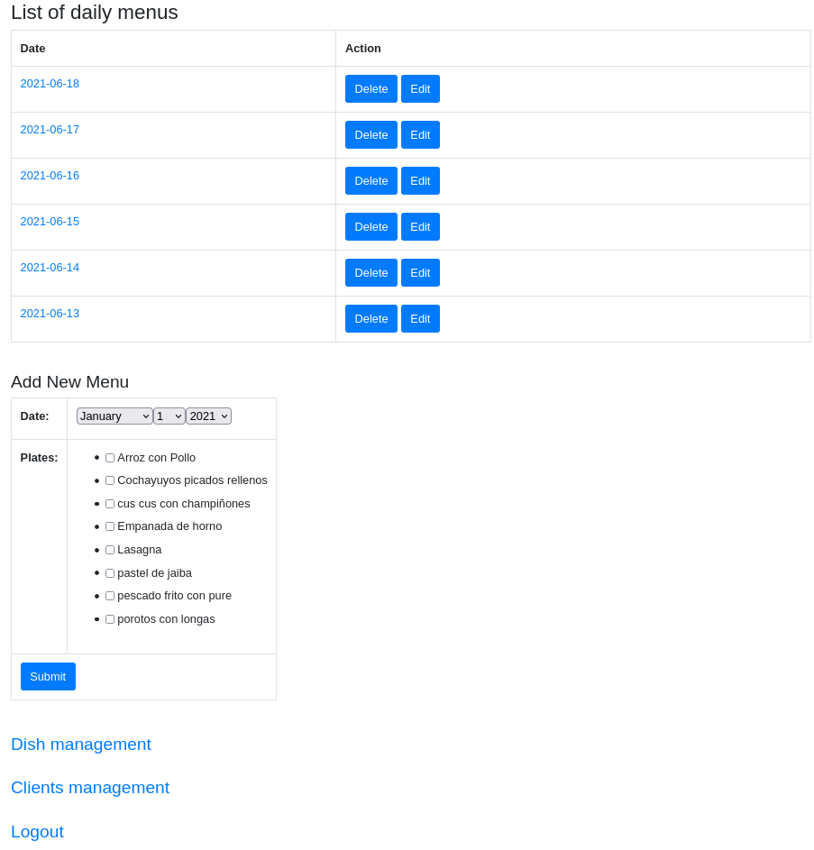
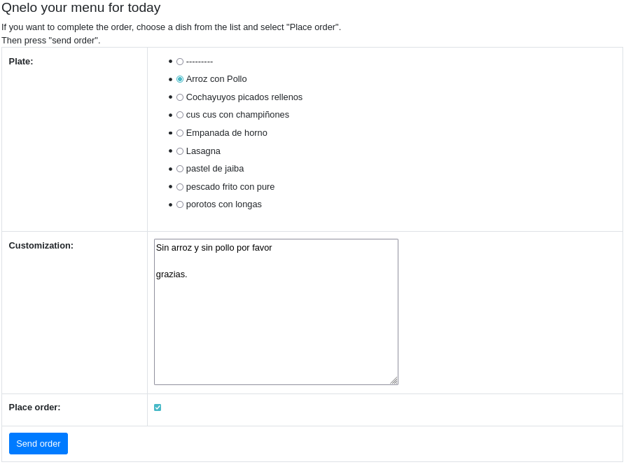
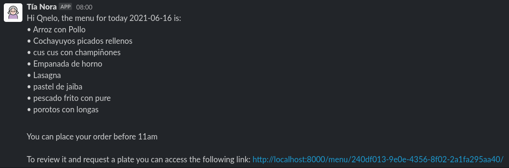

# Sections of the main page

The main page displays the options that the system allows Nora to manage menus, dishes and customers.

## Daily Menu List

It is a list where the menus created per day are displayed. In this same list we can choose to delete a menu or edit it.
In this list only the last 15 menus will be shown, sorted by the newest date.

**Edit Button:** This link leads to the menu maintainer, to check how it works, click [this link](edit_menu.md).

## Add New Menu

In this section you can create a new menu for a specific day.

### Day 

You must choose the day for which the menu will be created. If the selected day already has a menu, an error will be displayed when trying to send it.

### Plates
You can choose all dishes from the list.
Every time a new dish is created, it will appear in this list.

## Dish management

This link leads to the dish manager, to check how it works, [click this link](./dish_menu.md).

## Clients management

This link takes you to the clients manager, to check how it works, [click on this link](./client_menu.md).

## Logout

To log out of the system, redirect to the [login page](./login.md).

---

# Client page

Each user, when opening the link of the menu of the day, will be able to see the options of dishes, write the customization of the menu.

It is important to select the option "place order" to confirm that you want the dish.

The menu can be modified as many times as the customer wants until 11am CLT.

---

# Slack reminder system

Every day at 8am and 10am CLT a message is sent to Nora's customers through a slack message, as long as there is a menu created for that day. The second message will reach even users who have already selected a dish. The message will arrive only to users in Nora's database who are marked as users in Chile.

The slack message arrives via a bot that must be added to the workspace and will detail the menu of the day and the link for each user. In case a user shares their link, they run the risk of having their order changed or cancelled.

Each user will receive a unique link specific to that particular day. Each time you click on that link before 11am CLT you will be able to review the menu and edit it. If you deselect the "Place order" option, at the time the orders close (11am CLT), you will no longer be able to modify your order and Nora will not cook for that user that day.

---
[Back](../README.md)