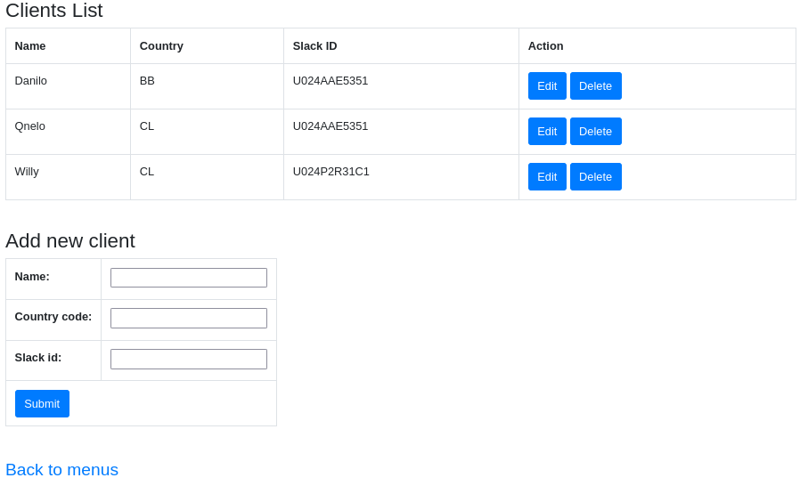

# Client List

The Client page displays the options that the system allows Nora to manage clients.

It is a list where the client created are displayed. In this same list we can choose to delete a client or edit it.

**Edit Button:** This link leads to the client maintainer, to check how it works, click [this link](edit_client.md).

## Add New Client

In this section you can create a new dish.

### Name

You must choose the name of the Client

### Country Code
You must set the country code using ISO 3166 country code `Alpha-2 code`

_example_: `CL` to Chile

### Slack id
You must set the slack id of the user, this is important because without this code you will not be able to send messages via slack. 

---
[Back](./README.md)