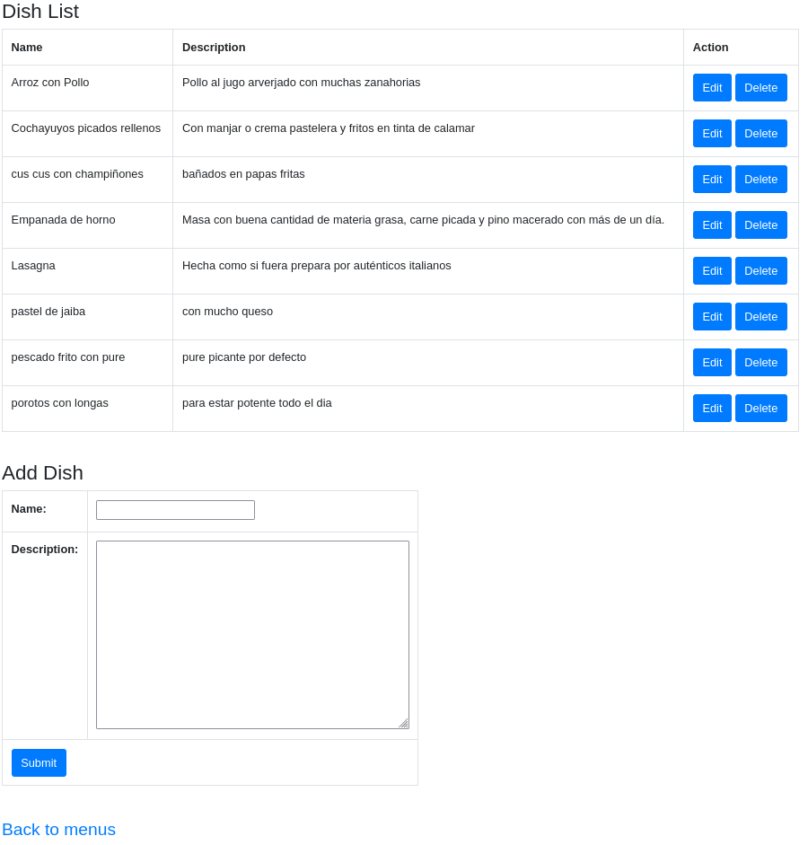

# Dish List

The dish page displays the options that the system allows Nora to manage dishes.

It is a list where the dishes created are displayed. In this same list we can choose to delete a dish or edit it.

**Edit Button:** This link leads to the dish maintainer, to check how it works, click [this link](edit_dish.md).

## Add New Dish

In this section you can create a new dish.

### Name

You must choose the name of the dish

### Description
You must choose the description of the dish

---
[Back](./README.md)